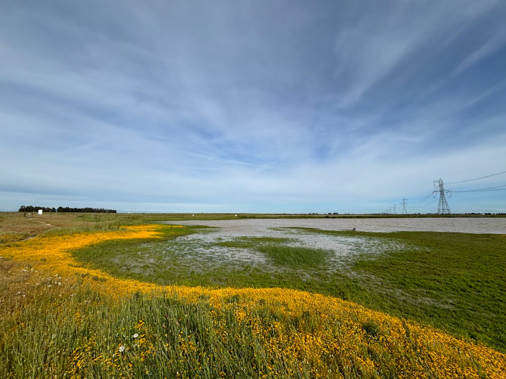
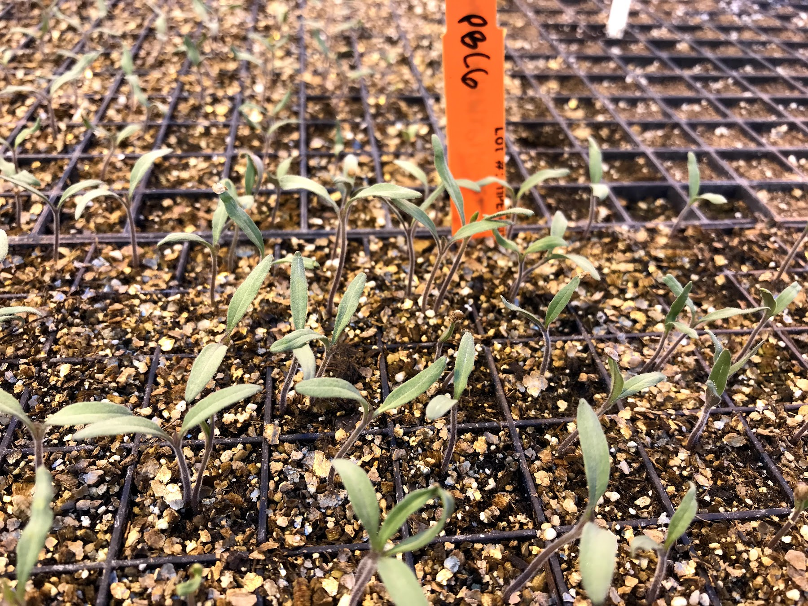
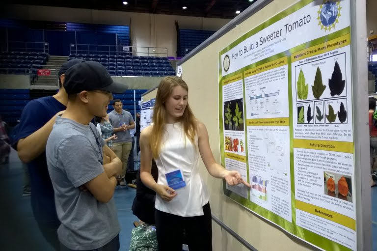
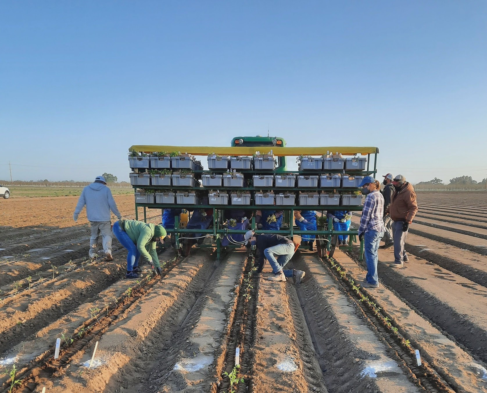

{alt="Erodium sp. seed stuck to the head of a Grindelia sp." style="float: right; margin: 0.5cm 0 1em 1em; border-radius: 8px;" width="400"}

### Seed dispersal in annual grassland community assembly

My dissertation investigates how species-specific seed dispersal influences community assembly in a model annual grassland in southern California. In this Mediterranean-climate system, mild winters and hot, dry summers require annual plants to complete their entire life cycle from germination to seed production within just a few months. This condensed growing season creates intense competition for limited resources, yet these grasslands support remarkably diverse plant communities.

Seed dispersal shapes where and when plants establish; it determines the abiotic conditions and competitive environment that seeds encounter upon arrival, influencing recruitment, growth, and survival. Seed persistence in the soil also allows species to delay germination until conditions become favorable. Together, these processes help determine how plant communities assemble each year.

Understanding how seeds move through landscapes is essential for understanding how and why biodiverse communities persist. This research advances our understanding of the ecological mechanisms that promote species coexistence while also informing applications such as habitat restoration, range expansion modeling under climate change, and conservation through seed banking.

My ongoing projects include quantifying seed dispersal across this diverse community of species, evaluating mechanistic approaches for estimating species-specific dispersal, and exploring how feedbacks between the local environment, plant performance, and dispersal influence community dynamics & species coexistence.

I conduct my dissertation research with [Dr. Nathan Kraft](https://sites.lifesci.ucla.edu/eeb-kraft/)'s plant community ecology research group at UCLA and at Sedgwick Reserve (UC Natural Reserve System) in Santa Barbara County, CA. UCLA acknowledges our institution's presence on the traditional, ancestral and unceded territory of the Gabrielino/Tongva peoples, who are the traditional caretakers of Tovaangar (encompassing areas of the Los Angeles basin & Southern Channel Islands). The Chumash peoples are the traditional caretakers of the land where our field research takes place at Sedgwick Reserve.

{alt="Vernal pool in spring in Solano County, CA" fig-align="left" style="float: left; margin: 0.5cm 0.5cm 0em 0; border-radius: 8px;" width="490"}

### Dispersal evolution and habitat specialization in California vernal pools

Prior to my PhD, I worked as a field technician in Dr. Nancy Emery's research group at the University of Colorado Boulder on a project investigating evolutionary feedbacks between seed dispersal and habitat specialization. \
\
California vernal pools are highly dynamic ecosystems. Annual variation in rainfall changes the depth and duration of seasonal flooding on impermeable hardpan soils, causing habitat quality to shift from year to year. Species that disperse seeds across a wider range of microsites may be more likely to encounter suitable conditions in future years, whereas species that keep seeds clustered risk losing entire cohorts if local conditions become unfavorable. This project investigated how habitat specialization, landscape heterogeneity, and seed dispersal strategies interact in three species of *Lasthenia* (goldfields) that occupy different positions along the vernal pool flooding gradient.\
\
For thousands of years, the land where Jepson Prairie exists today has been the home of Patwin people, including the present-day Yocha Dehe Wintun Nation. The Patwin people have cared for and stewarded these lands across generations.

::::::: {style="float: right; width: 50%; margin-left: 1em;"}
:::::: grid
::: g-col-6

:::

::: g-col-6

:::

::: g-col-12

:::
::::::
:::::::

### Genetics & plant breeding in tomatoes

My early research experience focused on genetics and plant breeding, specifically in tomatoes. \
\
As an undergraduate at UC Davis, I investigated the genetic basis of leaf shape and its relationship to fruit sugar content in heirloom tomatoes. Plants with broad, simple leaves (a characteristic known as potato leaf morph) were hypothesized to produce sweeter fruit than plants with highly dissected leaves because of differences in photosynthetic capacity. Using CRISPR-Cas9 gene editing, we mutated the gene controlling potato leaf morph and measured the resulting changes in leaf architecture and fruit sugar content. Depending on the type and size of the mutation, leaf phenotypes and sugar content varied widely. Ongoing research investigates how leaf shape contributes to sugar content, with the goal of identifying a practical breeding target for improving fruit quality.\
\
Following my time at UC Davis, I joined the tomato breeding program at a commercial vegetable seed company. I conducted independent research projects for both the fresh market and processing market tomato teams in addition to working with the ongoing seed, greenhouse, and field projects both on-site and in field trials across California's central valley.
